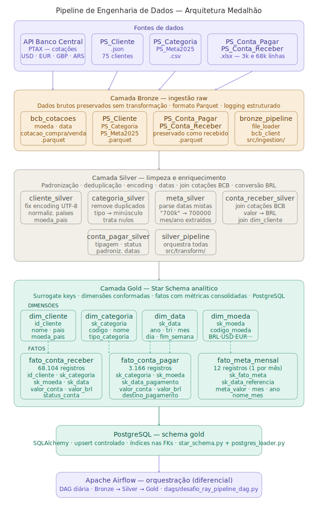

# Desafio Ray - Engenharia de Dados + ML + Orquestracao

Pipeline de dados financeiros com arquitetura medalhao (Bronze, Silver, Gold), enriquecimento cambial via API PTAX do Banco Central do Brasil, modelagem analitica em Star Schema e clusterizacao de clientes.


<details>
	<summary><h2>1. Arquitetura</h2></summary>

### 1.1 Visao geral

Uma empresa recebe dados de transações financeiras de diferentes países, porém
essas informações chegam em formato bruto, sem tratamento ou padronização.
Cabe ao time de Analytics realizar o mapeamento das cotações via API do Banco
Central do Brasil, de forma estruturada, utilizando arquitetura medalhão,
enriquecendo as informações existentes para que estejam prontas para consumo
analítico.
Após a consolidação da camada Gold, é desejável a aplicação de um algoritmo de
Machine Learning para agrupamento de clientes, utilizando o modelo mais
recomendado para o problema, com definição e justificativa do modelo e das
métricas escolhidas.


### 1.2 Camadas da arquitetura medalhao

- Bronze: padroniza dados brutos, preserva granularidade original e enriquece com cotacoes BCB.
- Silver: aplica regras de limpeza, padronizacao e calculos de negocio por tabela.
- Gold: modela para analytics em Star Schema (dimensoes e fatos), com carga opcional em PostgreSQL.

### 1.3 Orquestracao

- DAG Airflow com sequencia: bronze -> silver em paralelo -> gold -> ml.
- Execucao local alternativa via CLI: `python main.py --stage ...`.

</details>

<details>
	<summary><h2>2. Decisoes tecnicas e justificativas</h2></summary>

### 2.1 Linguagem e stack

- Python: ecossistema maduro para ETL, APIs, modelagem e ML.
- Pandas: adequado ao volume atual, produtividade alta e simplicidade para transformacoes tabulares.
- SQLAlchemy + PostgreSQL: persistencia analitica com governanca relacional e interoperabilidade com BI.

### 2.2 Star Schema na Gold

- Escolha: Star Schema.
- Justificativa: consultas analiticas mais simples, menos joins e melhor aderencia a Power BI.
- Detalhamento tecnico: [docs/gold_star_schema_decision.md](docs/gold_star_schema_decision.md).

### 2.3 Logging estruturado

- Logs em JSON com campos de contexto (`stage`, `dataset`, `status`, `error`).
- Saida em arquivo e console para observabilidade local e em orquestracao.

### 2.4 Airflow em Docker no Windows

- Escolha: Airflow em Docker Compose.
</details>

<details>
	<summary><h2>3. O que cada arquivo realiza</h2></summary>

### 3.1 Arquivos raiz

- [main.py](main.py): ponto de entrada do pipeline via CLI (`bronze`, `silver`, `gold`, `ml`, `all`).
- [requirements.txt](requirements.txt): dependencias de pipeline e ML.
- [requirements-airflow.txt](requirements-airflow.txt): dependencias de orquestracao Airflow.
- [.env.example](.env.example): template de configuracao de ambiente.
- [.gitignore](.gitignore): regras de versionamento.
- [docker-compose.airflow.yml](docker-compose.airflow.yml): stack Docker do Airflow + PostgreSQL de metadados.
- [AIRFLOW_MONITORING.md](AIRFLOW_MONITORING.md): guia de monitoramento operacional do Airflow.
- [Desafio-ray-Dashboard.pbix](Desafio-ray-Dashboard.pbix): arquivo do dashboard Power BI.

### 3.2 Pasta de documentacao

- [docs/gold_star_schema_decision.md](docs/gold_star_schema_decision.md): decisao arquitetural da modelagem Gold.

### 3.3 Pasta src/config

- [src/config/settings.py](src/config/settings.py): leitura de variaveis de ambiente e montagem de configuracoes de runtime.
- [src/config/__init__.py](src/config/__init__.py): inicializacao do pacote.

### 3.4 Pasta src/utils

- [src/utils/logging_utils.py](src/utils/logging_utils.py): logger JSON estruturado para pipeline.
- [src/utils/__init__.py](src/utils/__init__.py): inicializacao do pacote.

### 3.5 Pasta src/ingestion (Bronze)

- [src/ingestion/file_loader.py](src/ingestion/file_loader.py): leitura de CSV/JSON/XLSX e escrita em parquet/csv.
- [src/ingestion/bcb_client.py](src/ingestion/bcb_client.py): cliente HTTP para API PTAX do BCB.
- [src/ingestion/bronze_pipeline.py](src/ingestion/bronze_pipeline.py): ingestao Bronze e enriquecimento cambial.
- [src/ingestion/__init__.py](src/ingestion/__init__.py): inicializacao do pacote.

### 3.6 Pasta src/transform (Silver)

- [src/transform/meta_transform.py](src/transform/meta_transform.py): regras da tabela de metas.
- [src/transform/category_transform.py](src/transform/category_transform.py): normalizacao e deduplicacao de categorias.
- [src/transform/client_transform.py](src/transform/client_transform.py): padronizacao de clientes e moeda por pais.
- [src/transform/conta_pagar_transform.py](src/transform/conta_pagar_transform.py): calculos de pagar (atraso, valor BRL, status).
- [src/transform/conta_receber_transform.py](src/transform/conta_receber_transform.py): calculos de receber (atraso, valor BRL, status).
- [src/transform/silver_pipeline.py](src/transform/silver_pipeline.py): orquestracao das tabelas Silver.
- [src/transform/__init__.py](src/transform/__init__.py): inicializacao do pacote.

### 3.7 Pasta src/gold

- [src/gold/star_schema.py](src/gold/star_schema.py): construcao das dimensoes e fatos da Gold.
- [src/gold/postgres_loader.py](src/gold/postgres_loader.py): DDL, carga e indices no PostgreSQL.
- [src/gold/gold_pipeline.py](src/gold/gold_pipeline.py): geracao da Gold e carga opcional em PostgreSQL.
- [src/gold/__init__.py](src/gold/__init__.py): inicializacao do pacote.

### 3.8 Pasta src/ml

- [src/ml/ml_pipeline.py](src/ml/ml_pipeline.py): engenharia de atributos, comparacao de modelos de cluster e saidas de segmentacao.
- [src/ml/__init__.py](src/ml/__init__.py): inicializacao do pacote.

### 3.9 Orquestracao

- [dags/desafio_ray_pipeline_dag.py](dags/desafio_ray_pipeline_dag.py): DAG principal Airflow com encadeamento medalhao + ML.
- [docker/airflow/Dockerfile](docker/airflow/Dockerfile): imagem custom Airflow com dependencias do projeto.

### 3.10 Notebooks

- [notebooks/eda_exploratorio.ipynb](notebooks/eda_exploratorio.ipynb): exploracao de Bronze e Silver.
- [notebooks/ml_clustering_analysis.ipynb](notebooks/ml_clustering_analysis.ipynb): exploracao de resultados de clusterizacao.

</details>

<details>
	<summary><h2>4. O que e realizado em cada camada</h2></summary>

### 4.1 Bronze

Entradas:
- PS_Meta2025.csv
- PS_Categoria.csv
- PS_Conta_Pagar.xlsx
- PS_Conta_Receber.xlsx
- PS_Cliente.json
- API PTAX BCB

Processamento:
- Leitura de multiplos formatos.
- Padronizacao de persistencia (parquet, com fallback quando necessario).
- Ingestao de cotacoes (compra/venda) por moeda e data.

Saidas tipicas:
- [data/bronze/PS_Categoria.parquet](data/bronze/PS_Categoria.parquet)
- [data/bronze/PS_Cliente.parquet](data/bronze/PS_Cliente.parquet)
- [data/bronze/PS_Conta_Pagar.parquet](data/bronze/PS_Conta_Pagar.parquet)
- [data/bronze/PS_Conta_Receber.parquet](data/bronze/PS_Conta_Receber.parquet)
- [data/bronze/PS_Meta2025.parquet](data/bronze/PS_Meta2025.parquet)
- [data/bronze/bcb_cotacoes.parquet](data/bronze/bcb_cotacoes.parquet)

### 4.2 Silver

Processamento:
- Normalizacao de tipos e textos.
- Regras de negocio financeiras (dias de atraso, valor convertido, status).
- Enriquecimento de cliente com contexto de pais/moeda.

Saidas tipicas:
- [data/silver/meta_2025_silver.parquet](data/silver/meta_2025_silver.parquet)
- [data/silver/categoria_silver.parquet](data/silver/categoria_silver.parquet)
- [data/silver/cliente_silver.parquet](data/silver/cliente_silver.parquet)
- [data/silver/conta_pagar_silver.parquet](data/silver/conta_pagar_silver.parquet)
- [data/silver/conta_receber_silver.parquet](data/silver/conta_receber_silver.parquet)

### 4.3 Gold

Modelo analitico Star Schema:
- Dimensoes: `dim_cliente`, `dim_categoria`, `dim_data`, `dim_moeda`.
- Fatos: `fato_conta_receber`, `fato_conta_pagar`, `fato_meta_mensal`.

Saidas tipicas:
- [data/gold/dim_cliente.parquet](data/gold/dim_cliente.parquet)
- [data/gold/dim_categoria.parquet](data/gold/dim_categoria.parquet)
- [data/gold/dim_data.parquet](data/gold/dim_data.parquet)
- [data/gold/dim_moeda.parquet](data/gold/dim_moeda.parquet)
- [data/gold/fato_conta_receber.parquet](data/gold/fato_conta_receber.parquet)
- [data/gold/fato_conta_pagar.parquet](data/gold/fato_conta_pagar.parquet)
- [data/gold/fato_meta_mensal.parquet](data/gold/fato_meta_mensal.parquet)

PostgreSQL :
- Carga via SQLAlchemy controlada por variaveis de ambiente.

</details>

<details>
	<summary><h2>5. Machine Learning (explicacao e resultados)</h2></summary>

### 5.1 Objetivo

Segmentar clientes por comportamento financeiro para apoiar analise e priorizacao comercial.

### 5.2 Abordagem

- Engenharia de atributos sobre dados Silver (cliente, conta_receber, categoria).
- Variaveis de comportamento: recencia, frequencia, valor total/medio, atraso medio e mix de categoria.
- Preprocessamento com `StandardScaler` e `OneHotEncoder`.
- Comparacao de modelos:
	- KMeans (k de 2 a 8)
	- Agglomerative (k de 2 a 8)
- Selecao por ranking de metricas:
	- Silhouette (maior melhor)
	- Davies-Bouldin (menor melhor)
	- Calinski-Harabasz (maior melhor)

### 5.3 Resultado mais recente observado

Artefatos gerados:
- [data/ml/features_cliente.parquet](data/ml/features_cliente.parquet)
- [data/ml/model_comparison.parquet](data/ml/model_comparison.parquet)
- [data/ml/cliente_clusterizado.parquet](data/ml/cliente_clusterizado.parquet)

</details>

<details>
	<summary><h2>6. Exemplos visuais do que foi implementado</h2></summary>

### 6.1 Exemplo visual de arquitetura



O diagrama acima representa o fluxo completo de dados: desde as fontes (API BCB, arquivos JSON/CSV/XLSX) → enriquecimento na Bronze → transformações paralelas na Silver → modelagem em Star Schema na Gold → clusterização na camada ML.


### 6.2 Exemplo visual de BI

Arquivo de dashboard:
- [Desafio-ray-Dashboard.pbix](Desafio-ray-Dashboard.pbix)

</details>

<details>
	<summary><h2>7. Como executar</h2></summary>

### 7.1 Pre-requisitos

- Python 3.11+
- Docker Desktop (para Airflow)

### 7.2 Execucao local (CLI)

Instalacao:

```bash
python -m venv .venv
.venv\Scripts\activate
pip install -r requirements.txt
```

Execucoes:

```bash
python main.py --stage bronze
python main.py --stage silver --table all
python main.py --stage gold
python main.py --stage ml
python main.py --stage all
```

### 7.3 Execucao orquestrada com Airflow (Docker)

Inicializar metadata DB:

```bash
docker compose -f docker-compose.airflow.yml up --build airflow-init
```

Subir servicos:

```bash
docker compose -f docker-compose.airflow.yml up -d postgres airflow-dag-processor airflow-scheduler airflow-api-server
```

Trigger manual da DAG:

```bash
docker compose -f docker-compose.airflow.yml exec -T airflow-api-server airflow dags trigger desafio_ray_medallion_pipeline
```

Inspecionar estado das tasks em um run:

```bash
docker compose -f docker-compose.airflow.yml exec -T airflow-api-server airflow tasks states-for-dag-run desafio_ray_medallion_pipeline <run_id>
```

### 7.4 Configuracao de ambiente

Copie [ .env.example ] para `.env` e ajuste conforme necessidade do ambiente.

Pontos importantes:
- `GOLD_POSTGRES_ENABLED`: habilita/desabilita carga em PostgreSQL.
- `AIRFLOW_DAG_SCHEDULE`: cron da DAG.
- `AIRFLOW_DAG_RETRIES` e `AIRFLOW_DAG_RETRY_DELAY_MINUTES`: controle de tentativas.
- `AIRFLOW_TASK_EXECUTION_TIMEOUT_SECONDS`: timeout por task no DAG.

</details>

<details>
	<summary><h2>8. Troubleshooting rapido</h2></summary>

- DAG nao aparece:
	- validar `dags/desafio_ray_pipeline_dag.py`.
	- verificar logs do `airflow-dag-processor`.

- Run fica em `queued`:
	- confirmar DAG `unpaused`.
	- verificar se ha run ativa e `max_active_runs=1` bloqueando nova execucao.

- Falhas de auth interna no Airflow 3:
	- manter `AIRFLOW__API__SECRET_KEY` e `AIRFLOW__API_AUTH__JWT_SECRET` iguais entre servicos.

- Gold nao carrega no PostgreSQL local:
	- em Docker, `localhost` referencia o container; usar host correto ou manter `GOLD_POSTGRES_ENABLED=false`.

</details>


